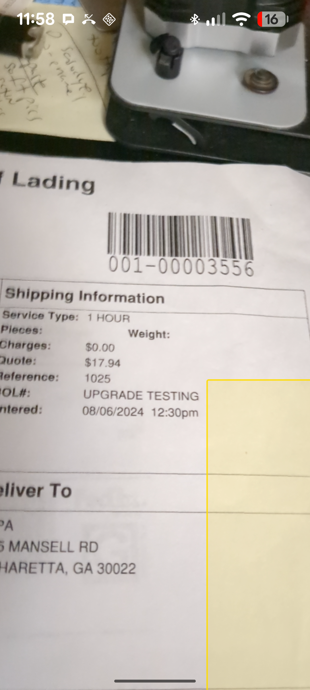

# Barcode Scanner POC — `convertCameraPointToViewPoint` bug reproducer

## Overview

Minimal Expo 54 + react-native-vision-camera v5 app that demonstrates incorrect
bounding-box positions when using `CameraRef.convertCameraPointToViewPoint()`.

## Steps to reproduce

1. Install dependencies and run on a physical Android device:
   ```sh
   npm install
   npx expo run:android
   ```
2. Point the camera at any barcode.
3. Observe the yellow bounding box — it does **not** align with the barcode on screen.

## Expected behaviour

The yellow bounding box should be drawn over the barcode as it appears in the
camera preview.

## Actual behaviour

The bounding box is significantly offset. Example observed on a Pixel 6a:



The box appears well below and partially off-screen to the right.

## Coordinate pipeline

```
MLKit boundingBox (frame-space pixels)
  └─► frame.convertFramePointToCameraPoint()   [in worklet, on Frame object]
        └─► camera-space coordinates  ← opaque, not necessarily 0–1 normalised
              └─► cameraRef.convertCameraPointToViewPoint()   [on JS thread, on CameraRef]
                    └─► view-space dp  ← these values appear wrong
```

The [Frame docs](https://visioncamera.margelo.com/api/react-native-vision-camera/hybrid-objects/Frame#convertframepointtocamerapoint)
explicitly state that camera sensor coordinates are **not necessarily normalised
from 0.0 to 1.0** — the coordinate system is opaque. The code treats it as
opaque: camera-space values from `convertFramePointToCameraPoint` are passed
directly into `convertCameraPointToViewPoint` without any transformation or
normalisation, which is the correct and only supported usage of the API.

The problem appears to be inside `convertCameraPointToViewPoint` itself — it
does not produce view-space dp values that match where the barcode actually
appears on screen.

## Environment

| Package | Version |
|---|---|
| Expo SDK | ~54.0.33 |
| react-native | 0.81.5 |
| react-native-vision-camera | 5.0.9 |
| react-native-vision-camera-barcode-scanner | 5.0.9 |
| react-native-vision-camera-worklets | 5.0.9 |
| react-native-worklets | 0.8.3 |

- New Architecture enabled (`newArchEnabled: true`)
- `edgeToEdgeEnabled: true`
- Portrait orientation only
- Pixel format: `'yuv'` (required for MLKit on Android)

## Key code

See [`App.tsx`](./App.tsx). The relevant sections are:

- **Frame processor** (`useFrameOutput` → `onFrame` worklet): scans barcodes,
  converts each corner from frame-space to camera-space, passes results to JS.
- **`camToView`** callback: calls `cameraRef.current.convertCameraPointToViewPoint()`
  to map camera-space → view-space dp.
- **`viewBoxes`** memo: computes final `{ left, top, width, height }` in dp and
  drives the yellow `<View>` overlays.
